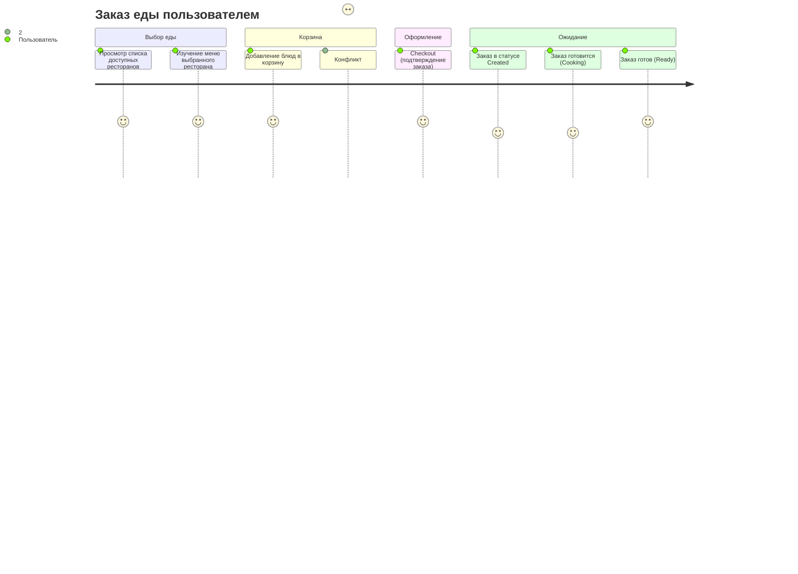
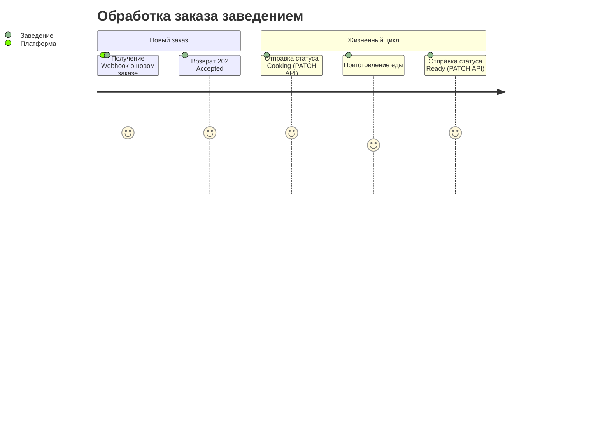
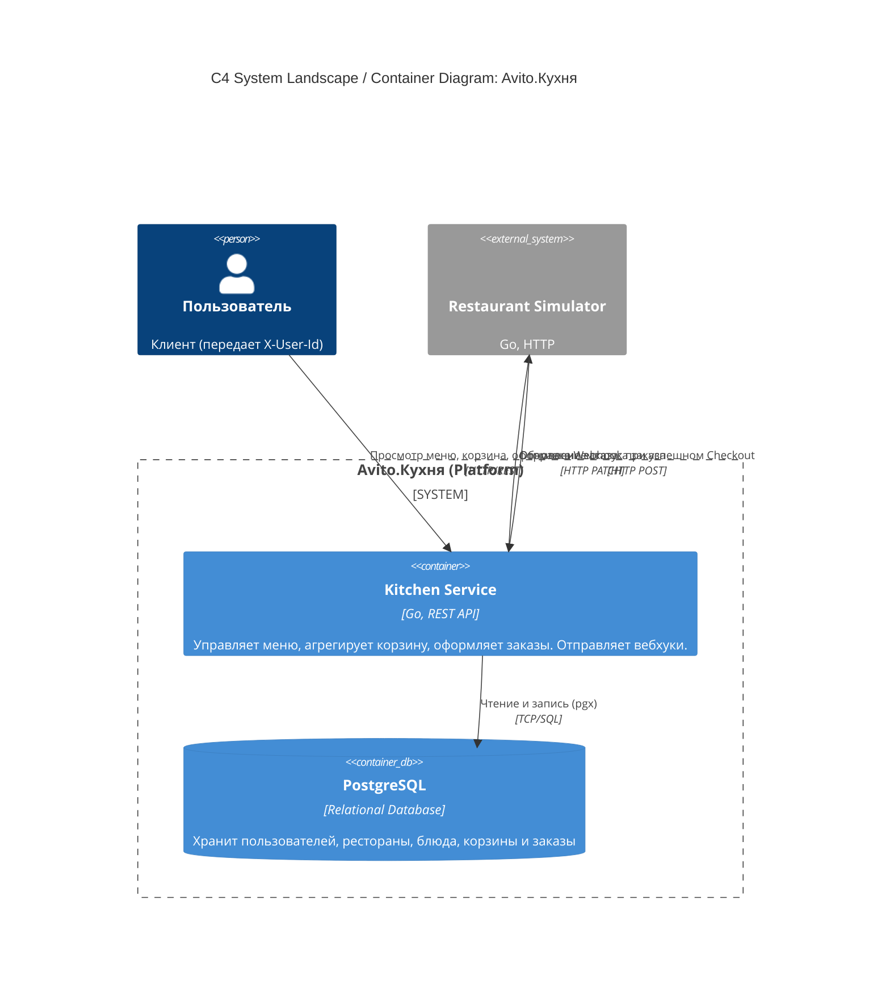
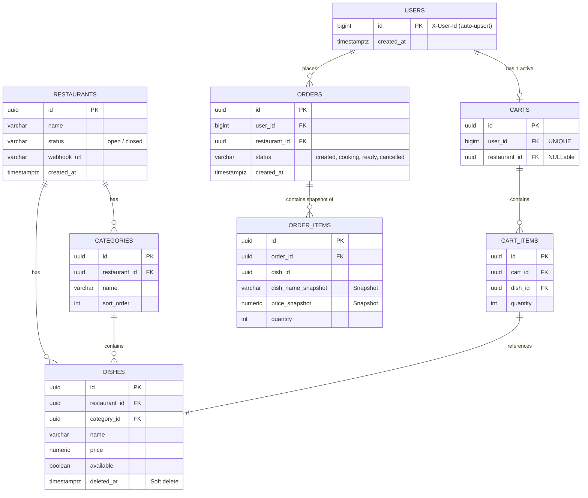

# Avito.Кухня (MVP) — Тестовое задание для стажёра Backend

## Описание проекта

**Avito.Кухня** — это сервис, расширяющий основной функционал площадки Авито, позволяющий пользователям заказывать доставку еды из ресторанов и кафе. Данный репозиторий содержит MVP (Minimum Viable Product) реализации backend-части системы, разработанной в рамках осенней волны стажировок 2026 года.

Система состоит из двух компонентов:
1. **Kitchen Service** (`kitchen-service`) — основная платформа, предоставляющая REST API для клиентов (просмотр меню, работа с корзиной, оформление заказа) и ресторанов (управление меню, статусы).
2. **Restaurant Simulator** (`restaurant-simulator`) — изолированный микросервис-заглушка, эмулирующий работу ресторана. Принимает заказы по вебхуку от `kitchen-service` и асинхронно обновляет статусы (created → cooking → ready).

## Технологический стек

- **Язык программирования:** Go (Golang)
- **База данных:** PostgreSQL
- **HTTP-роутер:** `go-chi/chi`
- **Кодогенерация API:** `oapi-codegen` (по спецификации OpenAPI 3)
- **Миграции:** `pressly/goose`
- **Инфраструктура:** Docker, Docker Compose

## Быстрый старт

Запуск проекта со всеми зависимостями (БД, сервис кухни, симулятор ресторана) осуществляется через Docker Compose:

```bash
docker compose up -d
```

При старте автоматически применяются миграции (`migrations/`) и заполняются тестовые данные (Seed Data: 2 ресторана, категории и меню).

**Основные эндпоинты после старта:**
- Kitchen Service API: `http://localhost:8080/api/v1`
- Swagger / OpenAPI схема: `api/openapi/openapi.yaml`

---

## Пользовательские сценарии (CJM)

Ниже представлены сценарии взаимодействия (Customer Journey Map) со стороны клиента площадки и со стороны заведения-партнера.

### CJM Пользователя (Покупателя)



### CJM Ресторана (Интеграция)



---

## Архитектура проекта (C4 Model)

Архитектура построена на базе Domain-Driven Design (DDD). Основной сервис `kitchen-service` разделен на модули: `menu`, `restaurant`, `order`.



---

## Схема базы данных

Для обеспечения консистентности (особенно при работе с корзинами и конкурентном оформлении заказов) спроектирована следующая реляционная схема:



**Особенности схемы БД:**
- **Cart (Корзина):** Ограничение `UNIQUE(user_id)` гарантирует только одну активную корзину на пользователя. Корзина "привязывается" к ресторану (`restaurant_id`) при добавлении первого блюда.
- **Cart Items:** Ограничение `UNIQUE(cart_id, dish_id)` позволяет безопасно выполнять Upsert (`INSERT ... ON CONFLICT DO UPDATE SET quantity = ...`) для инкремента количества. Цены не хранятся в корзине (подтягиваются "живые" из меню).
- **Order Items:** В отличие от корзины, в исторических заказах хранятся **снапшоты** (название и цена на момент `Checkout`), чтобы история не ломалась при изменении цен или удалении блюд в меню.

---

## Допущения и ограничения (MVP)

Для демонстрации работоспособности в заданные сроки, были приняты следующие архитектурные упрощения:

1. **Авторизация:** Согласно ТЗ, авторизация отключена. Пользователь идентифицируется по передаваемому HTTP-заголовку `X-User-Id` (число). Межсервисная авторизация при вызове `PATCH /orders/{id}/status` также не реализована.
2. **Гарантии доставки Webhook:** Отправка вебхука из платформы в симулятор происходит асинхронно после фиксации транзакции заказа в БД (best-effort). При исчерпании ретраев вебхук молча теряется, и заказ "зависает" в статусе `created`. Полноценное решение (outbox pattern + Message Broker вроде Kafka) избыточно для MVP.
3. **Состояние симулятора:** Симулятор ресторана хранит стейт выполняемых заказов *in-memory*. При перезапуске контейнера `restaurant-simulator` незавершенные заказы теряются.
4. **Отмена заказа:** Переход статусов строго регламентирован (конечный автомат). В MVP не реализована логика отмены заказа после того, как он перешел в статус `cooking`.
5. **Лимиты:** В рамках MVP отсутствуют лимиты на максимальное количество позиций в корзине и параллельных заказов от одного пользователя.
